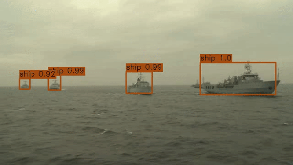

# Introduction
This repository trains a pre-trained Faster RCNN model, with a Resnet-50 backbone,
on an annotated dataset with three classes (aircraft, person, ship). 


# Project setup

## Environment setup
### 1. Create the pre-configured anaconda environment with the following command
```bash
conda env create -f environment.yml
```

### 2. Activate the environment
```bash
conda activate object_detection
```

## Data collection
To extract each Nth frame from the video, run
```shell
python data_collection.py --extract --nth_frame N
```

This will load the video in `data/raw` and save each Nth frame to `data/frames`.
You can then annotate this data using a tool of your choice, but the results must be exported in COCO format.
To split the dataset into a train/valid split with a set percentage of data in the training set.
```shell
python data_collection.py --split --percent_train 0.8
```
This will create train.json and valid.json files in `data/annotated/`

# Training

Run with the set hyper-parameters.
```shell
python train.py --batch_size BS --n_epochs N_EPOCHS --lr LR --tensoboard
```
This will train the model, log training metrics to tensorboard, and checkpoint the model to a `models` directory.
Validation metrics will be logged to the terminal.

# Inference
To perform inference with the trained model, run
```shell
python inference.py --model_name model_<EPOCH>.pth --thresh THRESH --tensorboard --data_path test --n_images N
```
This will load the model saved at EPOCH from the models directory on the given GPU
and save the annotated images to a tensorboard image grid. The cut-off bounding box threshold and number of images
to annotate from the test are also configurable.

To annotate a video, run
```shell
python inference.py --model_name model_<EPOCH>.pth --thresh THRESH --store_video --data_path test
```
