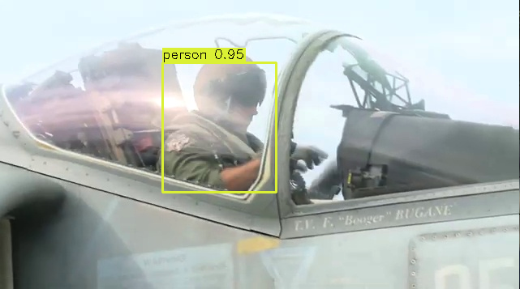

# Step 1 - Data Acquisition
I trained my model on a 360P version of the video to reduce resource requirements of the model. I also extracted every 2nd frame
from the video to reduce redundancy while still preserving sufficient information. However, in retrospect I could've been more aggressive
at this stage and selected each 5th frame. Given more time, I would extract key-frames by first capturing the curve saliency of the frames then
clustering the results to arrive at various groups of high-saliency and low-saliency frames. Since some frames are closer to the local maximum/minimum of
the group, these frames can be selected as its group representative. The specifics of this method are further elaborated here, 
[key-frame extraction](https://www.semanticscholar.org/paper/Key-Frame-Extraction-from-Motion-Capture-Data-by-Bulut-Bilkent/a5df9284369d009e9dec54bd8fb1492c18a90d08). 

# Step 2 - Data Labeling (2-3 hours)
I labeled my dataset using [labelstud.io](https://labelstud.io/) since it's free and can be launched locally. The tool is
easy to use, contains templates for different data labeling tasks (object detection, image classification, NER, Question Answering), and
facilitates organization of labeled data across multiple projects.

I labeled 192 images in labelstudio and exported my annotations in COCO format. The class distribution is shown below

The dataset is biased towards the "person" class so there is class imbalance; It's something I witnessed in the annotated video.
Furthermore, there is imbalance within the aircraft categories as there are more samples of jets than helicopters.
Two strategies I could utilize to mitigate this issue are: adding gaussian noise to training samples from the minority classes and
utilizing a generative model to create fake samples of the minority classes.

# Step 3 - Model Training and Evaluation (3-5 hours)

Aspect ratio does affect model performance, because lower aspect ratio images have a lower resolution and
reduce vital features necessary for the task. However, it's also necessary to downsample the image - depending on the input
size - to reduce training time and resource requirements. So, there must be a healthy balance between these
phenomenas. The Bicubic interpolation method fits well into this scenario, as it allows to downsample high-resolution images
while preserving vital features. I downsampled the images to 256x256 using Bicubic interpolation.

## Training setup
I trained my model on a single Tesla M60 GPU with the following hyper-parameters
- lr = 0.001
- batch_size = 8
- epochs = 50 (encountered gpu error at epoch 23)

How does your model perform on the validation set?
I utilized the pycocotools library to evaluate the model.
It provides a utility class to track evaluation metrics and
summarize the results.

```text
Average Precision  (AP) @[ IoU=0.50:0.95 | area=   all | maxDets=100 ] = 0.415
 Average Precision  (AP) @[ IoU=0.50      | area=   all | maxDets=100 ] = 0.634
 Average Precision  (AP) @[ IoU=0.75      | area=   all | maxDets=100 ] = 0.559
 Average Precision  (AP) @[ IoU=0.50:0.95 | area= small | maxDets=100 ] = -1.000
 Average Precision  (AP) @[ IoU=0.50:0.95 | area=medium | maxDets=100 ] = 0.283
 Average Precision  (AP) @[ IoU=0.50:0.95 | area= large | maxDets=100 ] = 0.467
 Average Recall     (AR) @[ IoU=0.50:0.95 | area=   all | maxDets=  1 ] = 0.352
 Average Recall     (AR) @[ IoU=0.50:0.95 | area=   all | maxDets= 10 ] = 0.454
 Average Recall     (AR) @[ IoU=0.50:0.95 | area=   all | maxDets=100 ] = 0.454
 Average Recall     (AR) @[ IoU=0.50:0.95 | area= small | maxDets=100 ] = -1.000
 Average Recall     (AR) @[ IoU=0.50:0.95 | area=medium | maxDets=100 ] = 0.283
```

## What performance metrics did you choose and why?
I logged the training losses in tensorboard to gauge model performance on the training set in addition
to the evaluation metrics above. The image below shows the training loss gradually decreasing, which
would help me determine which portion of the model is improving/degenerating.


## What are the learning parameters and how did you optimize them?
I optimized the differential parameters from the model using SGD.

## How can you tell if your model is overfit?
If it obtains a lower loss on the training set than the validation set.
In the context of object detection, you can tell that the model overfit if it
detects some classes with high confidence while obtaining low confidence on others.

# Step 4 - Model Testing (2 hours)

## Good samples


<p>
The pilot is correctly detected with a high confidence despite glare
and occlusion from the helmet.
</p>


<p> All the ships are detected even the distant silhouette in the background!</p>


<p>
All the people in the room are detected with a decent confidence score. Once again, the
model shows ability to detect occluded objects - man behind the monitor.
</p>

## Bad samples

<p>
The person is detected but the objects in the background are incorrectly classified as 
ships.
</p>


<p>
The aircraft is not classified. My model struggled detecting this class as the training
set is biased towards people.
</p>


<p>
The helicopter is detected but classified as a ship.
I can understand why it's the case, since the outline of the helicopter does resemble a navy ship.
</p>


<p>
This last sample highlights the model's bias towards the person class.
The person is detected with a very high confidence, but the helicopter
in the background is not detected at all.
</p>

Annotated test video is located at `data/test/NATO Response Force exercise goes live_annot.mp4`
 
